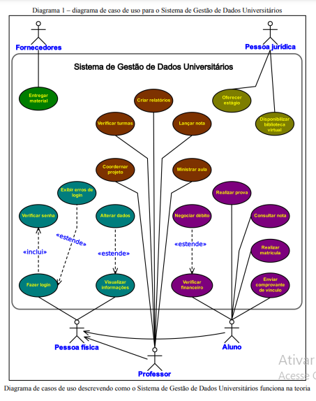
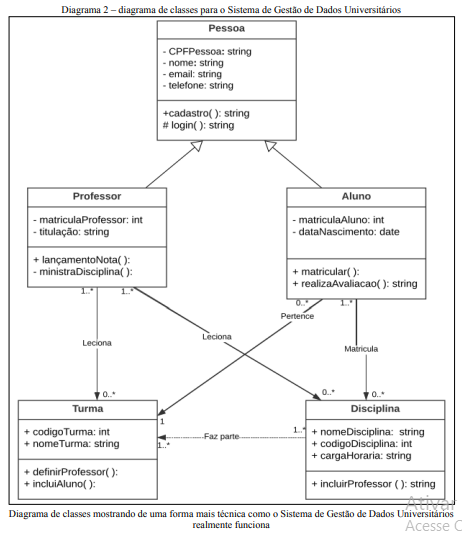
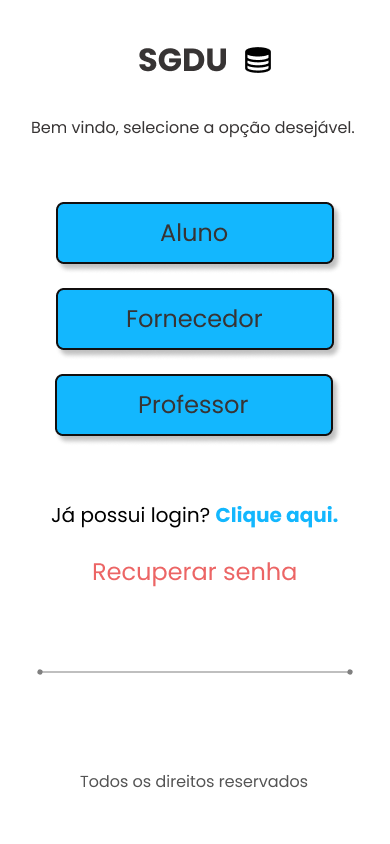
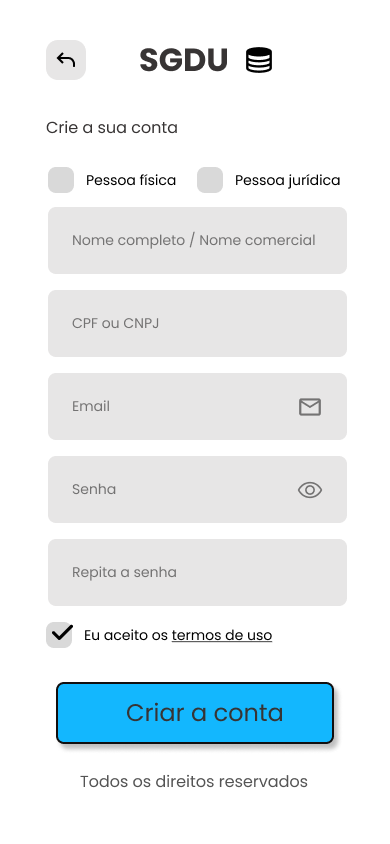

# Sistema de Gestão Escolar

## Descrição
Este projeto é um sistema de gestão escolar desenvolvido como parte do **Projeto Integrador** do curso de Tecnologia em Análise e Desenvolvimento de Sistemas no **SENAC**. O sistema é orientado a objetos e visa facilitar a administração escolar, incluindo funcionalidades como cadastro de pessoas (físicas e jurídicas), matrícula de alunos, lançamento de notas por professores, entre outras.

## Integrantes do Grupo
- Doris Campos Mendonça
- Gabrielle Trivelato Silva
- Henrique Lilge Birriel
- Hermes Renato Serra
- Letícia Cailane Carvalho de Oliveira
- Paulo Ribeiro de Carvalho Neto
- Renata Beatriz Fiorini Costa

## Funcionalidades Principais

### 1. Cadastro de Pessoa Física
Permite o cadastro de professores e alunos no sistema, onde o usuário preenche informações como nome, CPF, e-mail e senha.
### 2. Cadastro de Pessoa Jurídica
Permite o cadastro de empresas no sistema, onde o usuário preenche informações como nome da empresa, CNPJ, e-mail e senha.

### 3. Matrícula
Permite que os alunos realizem a matrícula nas disciplinas desejadas, verificando a disponibilidade de vagas e possíveis pendências financeiras.

### 4. Lançamento de Notas
Permite que os professores lancem as notas dos alunos em disciplinas específicas, com validação de informações e permissões.

### 5. Consulta de Notas
Permite que os alunos consultem suas notas em disciplinas específicas através do sistema.

## Diagramas
### 1. Diagrama de Caso de Uso
Representa as principais interações entre os usuários (professores, alunos, fornecedores) e o sistema, destacando os principais casos de uso.

### 2. Diagrama de Classe
Representa a estrutura do sistema, detalhando as classes principais, seus atributos e métodos, bem como os relacionamentos entre elas.

## Protótipos de Telas

### 1. Tela de Login
Esta tela permite que os usuários (alunos, professores, fornecedores) façam login no sistema utilizando suas credenciais.
#### Versão Mobile

#### Versão Desktop

### 2. Tela de Cadastro de Pessoa Física ou Jurídica
Nesta tela, é possível cadastrar uma nova Pessoa Física ou Juridíca no sistema.

#### Versão Mobile

#### Versão Desktop

## Pré-requisitos
- O usuário deve estar autenticado para realizar operações no sistema.
- As notas devem ser cadastradas pelos professores para que os alunos possam consultá-las.
- O sistema deve estar online e funcional para permitir acesso aos alunos e professores.

## Como Usar
1. **Login**: Acesse o sistema utilizando suas credenciais.
2. **Cadastro de Usuários**: Administre o cadastro de pessoas físicas e jurídicas.
3. **Matrícula**: Alunos podem se matricular nas disciplinas desejadas.
4. **Lançamento de Notas**: Professores podem lançar e atualizar as notas dos alunos.
5. **Consulta de Notas**: Alunos podem visualizar suas notas em disciplinas específicas.

## Tecnologias Utilizadas
- Programação orientada a objetos
- UML para modelagem do sistema
- Figma para prototização das telas
